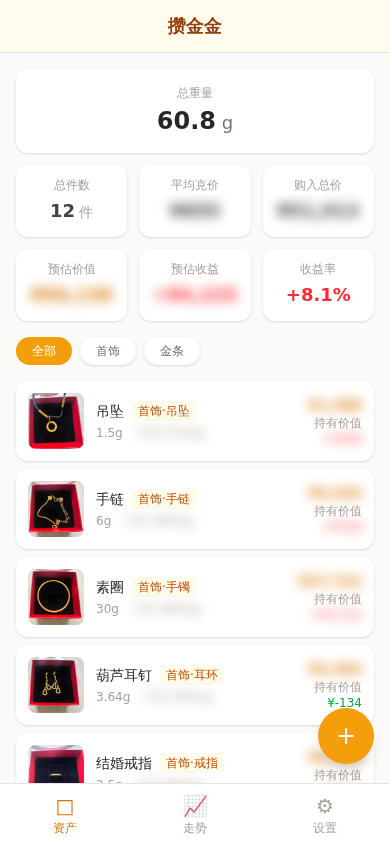
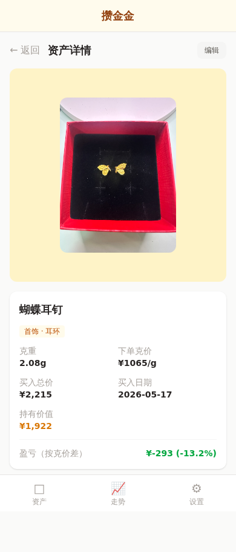
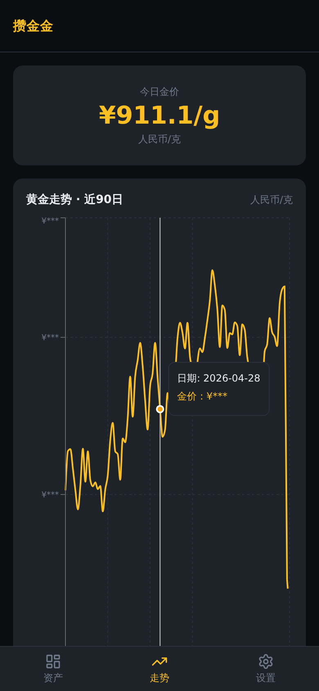

# 攒金金 Goldkeep

个人实物黄金资产追踪工具。记录首饰和金条的买入信息，查看每日金价走势，实时了解持仓价值。

## 功能特性

- **资产管理** — 添加、编辑、删除黄金资产（首饰/金条），记录克重、买入克价、买入总价、购买日期和备注。照片异步上传，保存时自动等待上传完成
- **分类筛选** — 按全部/首饰/金条筛选资产列表，首饰支持细分（手镯、项链、戒指、耳环、吊坠、手链）
- **持仓概览** — 首页汇总总克重、总买入金额、当前持仓价值，每项资产展示浮动盈亏
- **金价走势** — 每日金价折线图，每小时自动从公开 API 获取最新金价
- **客户端缓存** — 资产列表和金价数据缓存在内存中，页面切换即时展示，写操作自动更新缓存
- **照片上传** — 每个资产支持上传实物照片，详情页支持照片灯箱放大查看
- **密码保护** — 单用户模式，密码登录保护，支持修改密码
- **响应式布局** — 移动端优先设计，适配手机和桌面浏览器

## 界面预览

| 资产列表 | 资产详情 | 金价走势 |
|---|---|---|
|  |  |  |

## 技术栈

| 层 | 技术 |
|---|---|
| 前端 | React 19 + TypeScript + Vite |
| 样式 | Tailwind CSS v4 |
| 图表 | Recharts |
| 后端 | Python FastAPI |
| ORM | SQLAlchemy + SQLite |
| 部署 | Docker Compose + Nginx |

## 快速开始

### Docker 部署（推荐）

```bash
docker compose up -d
```

前端运行在 `http://localhost:80`，后端 API 运行在 `http://localhost:8000`。

数据持久化在两个 Docker Volume 中：
- `goldkeep_data` — SQLite 数据库文件
- `goldkeep_uploads` — 资产照片

初始密码通过环境变量 `INITIAL_PASSWORD` 设置（默认 `f452cbe6326b14f5`），首次启动自动创建。

### 本地开发

**后端：**

```bash
cd backend
python -m venv venv && source venv/bin/activate
pip install -r requirements.txt
uvicorn app.main:app --reload --port 8000
```

后端运行在 `http://localhost:8000`，Swagger 文档在 `http://localhost:8000/docs`。

**前端：**

```bash
cd frontend
npm install
npm run dev
```

前端开发服务器运行在 `http://localhost:5173`，API 请求自动代理到后端。

## 项目结构

```
├── frontend/                # React SPA
│   ├── src/
│   │   ├── api/             # API 客户端
│   │   │   ├── client.ts    # fetch 封装，含 JWT 注入
│   │   │   ├── assets.ts    # 资产 CRUD 接口
│   │   │   ├── cache.ts     # 客户端内存缓存
│   │   │   ├── auth.ts      # 登录/改密接口
│   │   │   └── goldPrice.ts # 金价查询接口
│   │   ├── hooks/           # React Hooks
│   │   │   └── useData.ts   # 数据获取与缓存 hooks
│   │   ├── components/      # 通用组件
│   │   │   ├── AssetCard.tsx       # 资产卡片
│   │   │   ├── GoldChart.tsx       # 金价走势图
│   │   │   ├── Layout.tsx          # 页面布局（含底部导航）
│   │   │   ├── ProtectedRoute.tsx  # 登录鉴权路由守卫
│   │   │   └── SummaryCards.tsx    # 持仓概览卡片
│   │   ├── pages/           # 页面
│   │   │   ├── Dashboard.tsx   # 首页（资产列表 + 筛选）
│   │   │   ├── AssetDetail.tsx # 资产详情
│   │   │   ├── AssetForm.tsx   # 添加/编辑资产
│   │   │   ├── Trend.tsx       # 金价走势页
│   │   │   ├── Login.tsx       # 登录页
│   │   │   └── Settings.tsx    # 设置页（改密）
│   │   ├── store/           # 状态管理
│   │   │   └── auth.tsx     # 认证状态 Context
│   │   ├── App.tsx          # 路由定义
│   │   └── main.tsx         # 入口
│   └── Dockerfile
├── backend/                 # FastAPI 服务
│   ├── app/
│   │   ├── main.py          # 应用入口，注册路由
│   │   ├── models.py        # SQLAlchemy 数据模型
│   │   ├── schemas.py       # Pydantic 请求/响应模型
│   │   ├── database.py      # 数据库连接与 Session 管理
│   │   ├── auth.py          # 密码验证与 JWT 签发
│   │   ├── assets.py        # 资产 CRUD 路由
│   │   ├── gold_price.py    # 金价查询与刷新路由
│   │   ├── fetch_gold.py    # 外部金价 API 抓取
│   │   ├── config.py        # 配置常量
│   │   ├── middleware.py    # HTTP 中间件
│   │   └── seed.py          # 数据库初始化（用户 & 金价）
│   ├── uploads/             # 照片上传目录
│   └── Dockerfile
├── CONTEXT.md               # 领域语言词汇表
└── docker-compose.yml
```

## API 接口

| 方法 | 路径 | 说明 | 鉴权 |
|---|---|---|---|
| POST | `/api/auth/login` | 密码登录，返回 JWT | 否 |
| POST | `/api/auth/change-password` | 修改密码 | 是 |
| GET | `/api/assets` | 获取资产列表 | 是 |
| POST | `/api/assets` | 创建资产 | 是 |
| GET | `/api/assets/{id}` | 获取资产详情 | 是 |
| PUT | `/api/assets/{id}` | 更新资产 | 是 |
| DELETE | `/api/assets/{id}` | 删除资产 | 是 |
| POST | `/api/assets/upload` | 上传资产照片 | 是 |
| GET | `/api/gold-prices` | 获取历史金价列表 | 是 |
| GET | `/api/gold-prices/latest` | 获取最新金价 | 是 |
| POST | `/api/gold-prices/refresh` | 手动刷新今日金价 | 是 |

## 数据模型

### 黄金资产（gold_assets）

| 字段 | 类型 | 说明 |
|---|---|---|
| id | int | 主键 |
| name | string | 资产名称 |
| classification | string | 分类：`jewelry` 或 `gold_bar` |
| subtype | string? | 首饰子类型：bracelet/chain/ring/necklace/earrings/pendant |
| weight | float | 克重 |
| purchase_price_per_gram | float | 买入克价（元/克） |
| purchase_price | float | 买入总价（元） |
| purchase_date | string | 购买日期 |
| photo | string? | 照片文件名 |
| notes | string | 备注 |
| created_at | datetime | 创建时间 |

### 金价记录（gold_prices）

| 字段 | 类型 | 说明 |
|---|---|---|
| id | int | 主键 |
| date | string | 日期（唯一） |
| price | float | 当日金价（元/克） |

## 配置说明

Docker Compose 环境变量：

| 变量 | 默认值 | 说明 |
|---|---|---|
| `DATABASE_URL` | `sqlite:////app/data/goldkeep.db` | 数据库连接地址 |
| `UPLOAD_DIR` | `/app/uploads` | 照片上传目录 |
| `INITIAL_PASSWORD` | `f452cbe6326b14f5` | 初始登录密码 |

## 设计边界

- 不区分金纯度，所有资产按纯金计价
- 不单独记录工费，买入总价已包含全部费用
- 单用户模式，无注册、多租户、角色系统
- 金价粒度为每日一次，不涉及实时或日内价格
